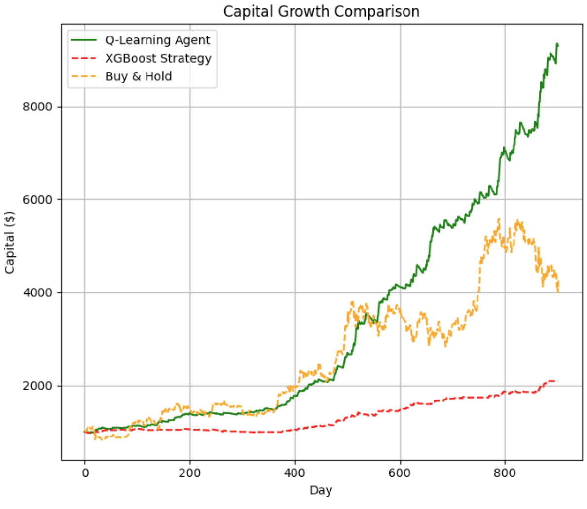

**Disclaimer**  
This live trading bot is still under development and not ready for live use. The backtesting notebook [`DQN_agent.ipynb`](./DQN_agent.ipynb), on the other hand, is working and contains the core logic. The goal is to eventually adapt this setup for live (paper)trading.

# Introduction

This notebook shows how a deep reinforcement learning model was trained for Bitcoin trading. It uses a mix of on-chain data, technical indicators, and sentiment features. Predictions from an XGBoost ensemble are used as input, and play a key role in the bot’s decisions.

The model is a Double Deep Q-Network (DQN) with Prioritized Experience Replay. Different trading strategies were evaluated like stop-loss, take-profit, trailing stops, maximum holding periods and position sizing. Trading parameters and model hyperparameters were tuned with Optuna.

# Results

Backtesting results were promising, as shown in below figure.

# Acknowledgements

Generative AI tools such as ChatGPT and Gemini were used to support the coding process in this notebook.
